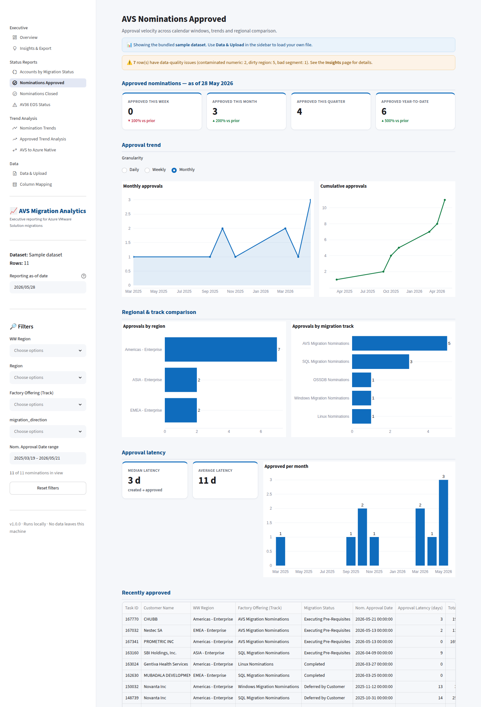
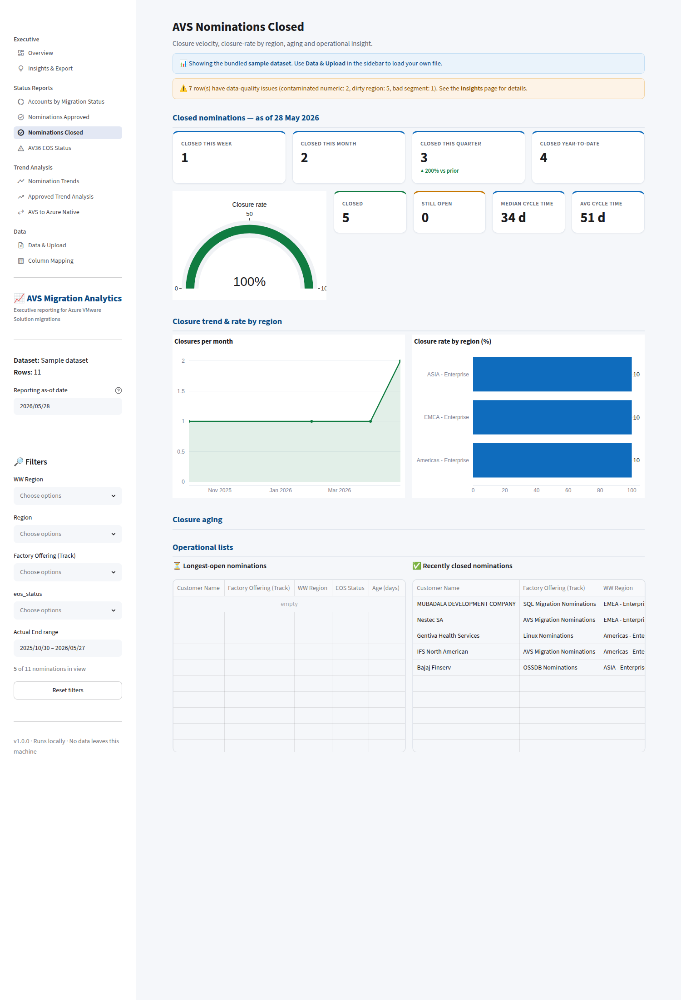
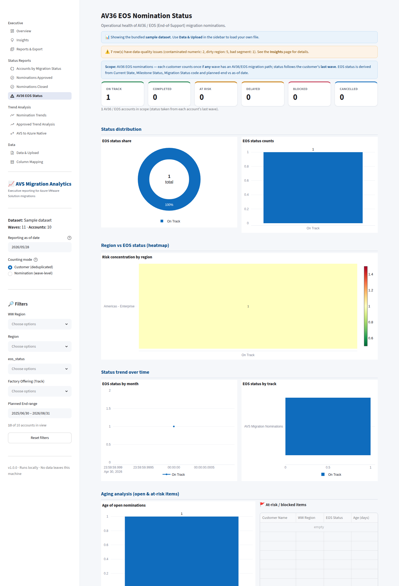
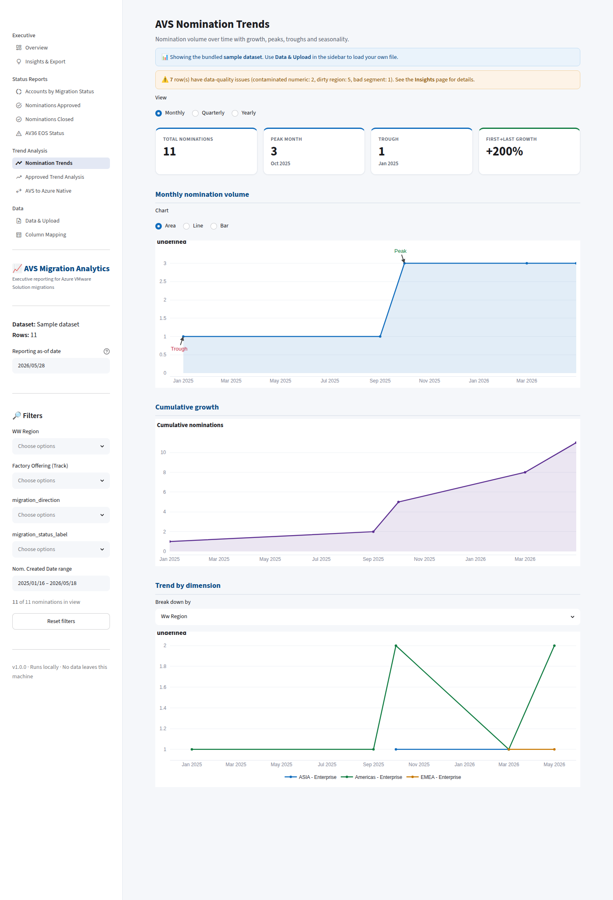
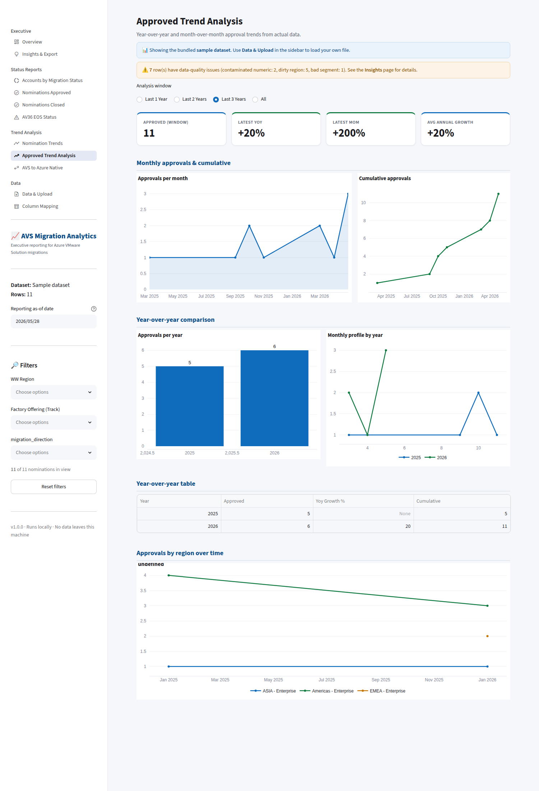
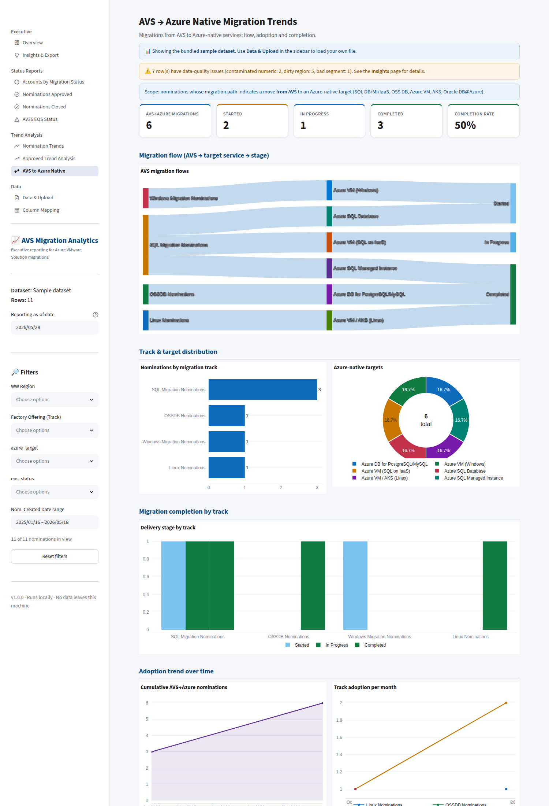

# Screenshot Gallery

Live captures of every report (rendered from the bundled sample dataset).

## Executive Overview
Portfolio KPIs, status & regional distribution, delivery‑health charts, and top insights.

## 1 · Accounts by Migration Status
Donut + stacked bar + Region × Status heatmap + drill‑down grid.

## 2 · Nominations Approved
This‑Week/Month/Quarter/YTD KPIs, approval trend & cumulative, regional/track comparison.

## 3 · Nominations Closed
Closure velocity, closure‑rate gauge, aging, longest‑open & recently‑closed lists.

## 4 · AV36 EOS Status
Derived status taxonomy, Region × EOS heatmap (risk concentration), trend & aging.

## 5 · Nomination Trends
Monthly/quarterly/yearly volume with peak/trough annotations, cumulative, seasonality.

## 6 · Approved Trend Analysis
1/2/3‑year windows, YoY & MoM, cumulative and growth rates (actuals only).

## 7 · AVS → Azure Native
Sankey flow, track & target distribution, Started/In‑Progress/Completed, adoption trend.

## Insights & Export
Full deterministic insights engine, grouped by category, with one‑click PDF export.

## Data & Upload
File upload with a per‑column fill/quality profile of the source file.

## Column Mapping
Map source headers to analytics fields; save mappings for reuse.

---

### Executive PDF export
The one‑click PDF (cover, executive summary, KPI grid, charts, insights, key tables) is
generated entirely locally. A sample is shown below.

> Generate it live from **Insights & Export → Generate PDF report**.
