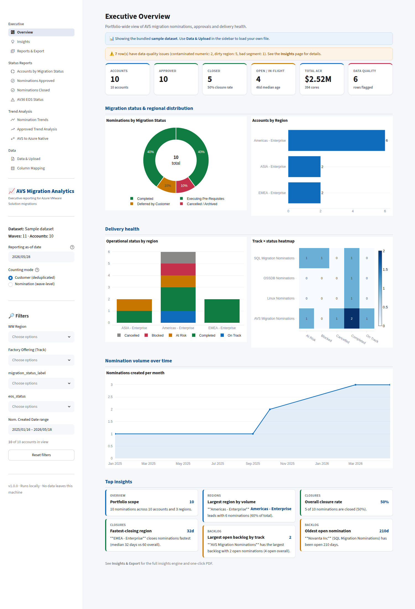
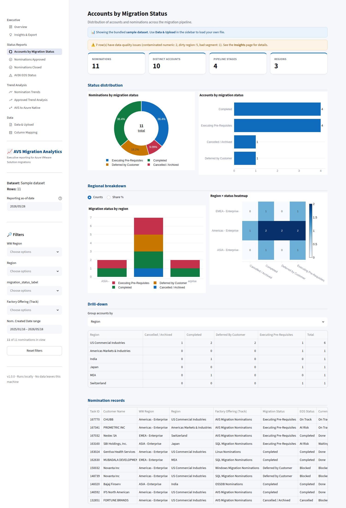
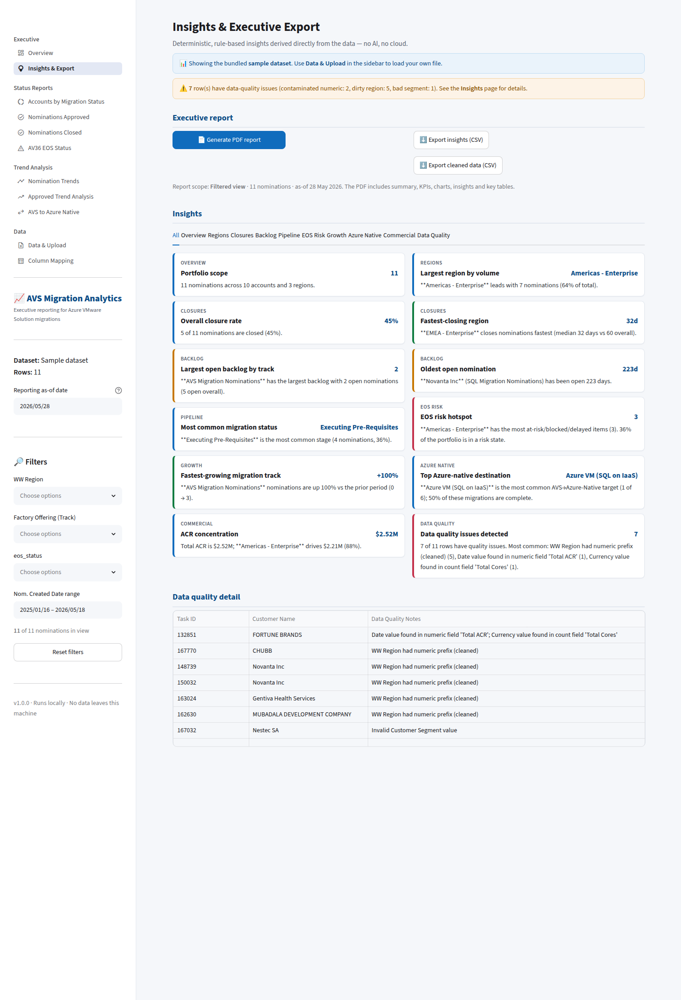
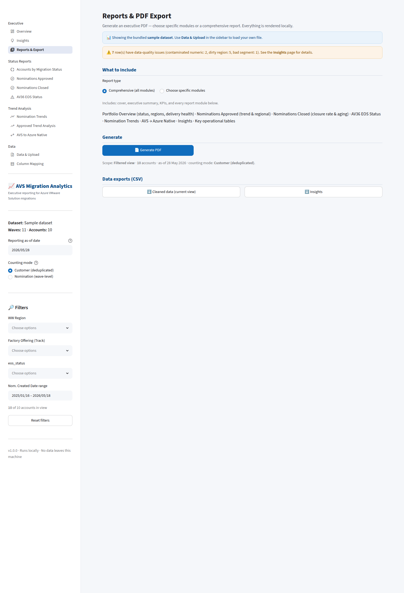
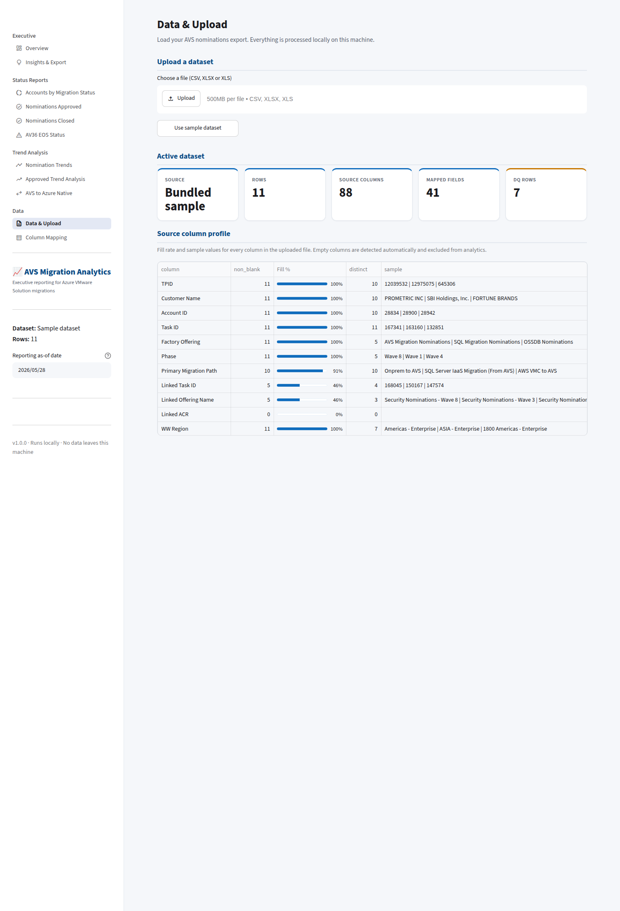
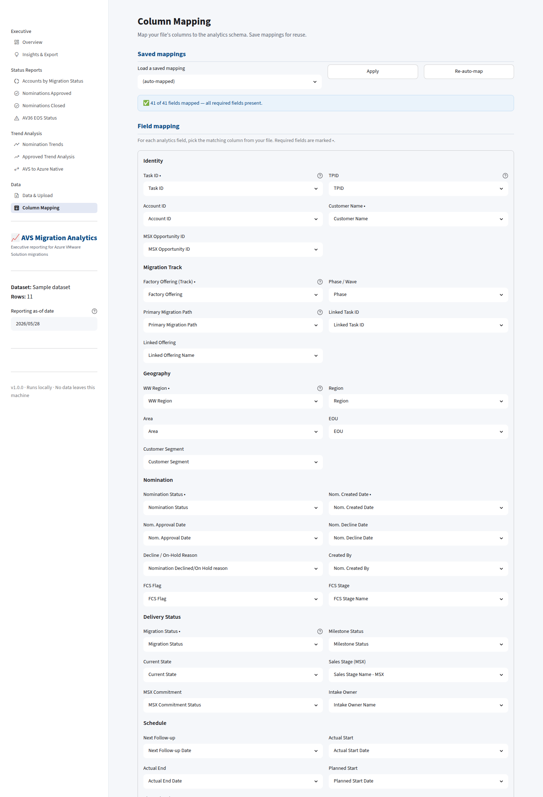

# Screenshot Gallery

Live captures of every report (rendered from the bundled sample dataset).

## Executive Overview
Portfolio KPIs, status & regional distribution, delivery‑health charts, and top insights.

## 1 · Status Report
One page per migration category — **All AVS Migrations**, **EOS Migrations (All / Gen‑1 /
Gen‑2)** and **AVS → Azure Native** — each with headline metrics, the current pipeline, a
regional breakdown by **WW Region** whose stacked‑bar segments drill into that region
*and* stage (stages shown by code, with a key), and
detailed data at **one row per account (TPID)**. **EOS Migrations (All)** additionally
carries the monthly programme matrix — *Gen1 to Gen1* and *Gen1 to Gen2*, every month
from July 2025 onwards including the empty ones.

## 2 · Trend Analysis
One page per measure, every migration category as a section on it — *Nomination
Trends*, *ACR Trend*, *Nodes Deployed*, *Cores Migrated* and *Migrations Completed* —
so a measure reads across the portfolio rather than a category at a time. Monthly bars
with a cumulative line, click‑through to the records behind any month, and one line per
fiscal year over "All time".

_Screenshots pending: these pages replaced the former Nomination Trends, Approved Trend
Analysis and AVS → Azure Native Trends reports._

## Insights
Full deterministic insights engine, grouped by category.

## Reports & Export
Build a comprehensive report or pick specific modules, then take it as a **PDF** to
print or file, or as a **single interactive HTML file** to email — the dashboard's
charts, accordions and sortable tables in one self‑contained attachment that opens
with no network. Plus one‑click CSV extracts.

## Data & Upload
One or more files loaded as a single dataset (an AVS export and an Azure‑native export,
say), with a per‑column fill/quality profile, a per‑file contribution table, and a
full diagnosis — stage, cause, origin, traceback — whenever an upload fails.

## Column Mapping
Map source headers to analytics fields; save mappings for reuse.

---

### Executive PDF export
The one‑click PDF (cover, executive summary, KPI grid, charts, insights, key tables) is
generated entirely locally. A sample is shown below.

> Generate it live from **Insights & Export → Generate PDF report**.
